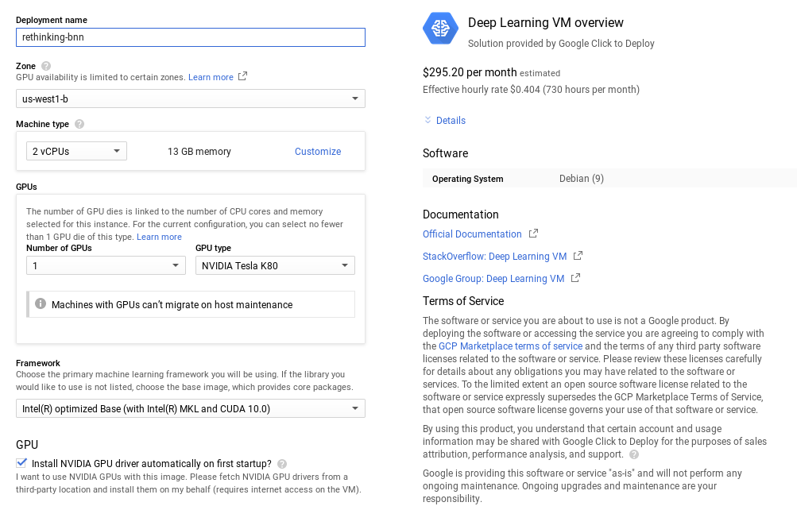

### Running experiments on GCP

If you want to run these experiments on Google's deep learning VM (on GCP),
you can follow these instructions. We assume that you have deployed a clean instance with
CUDA10.0 and have an ssh connection to it.



First get a copy of this repository:

```
git clone https://github.com/plumerai/rethinking-bnn-optimization.git
cd rethinkin-bnn-optimization/gcp-docs
```

Then run the command below, which takes around 10 minutes.

```
./setup_google_dl_vm.sh
```

Then you can use the `bnno` command like in the root `README.md` of this project:

```
bnno train binarynet \
    --dataset cifar10 \
    --preprocess-fn resize_and_flip \
    --hparams-set bop \
    --hparams threshold=1e-6,gamma=1e-3
    --tensorboard
``